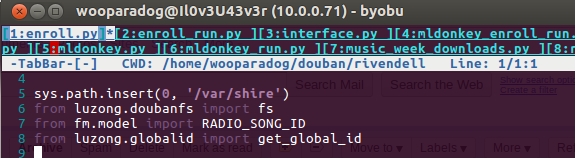
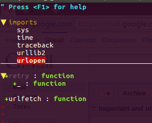
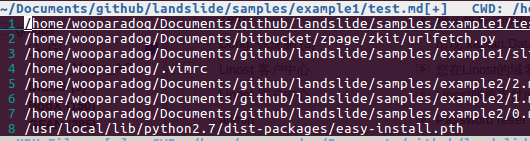
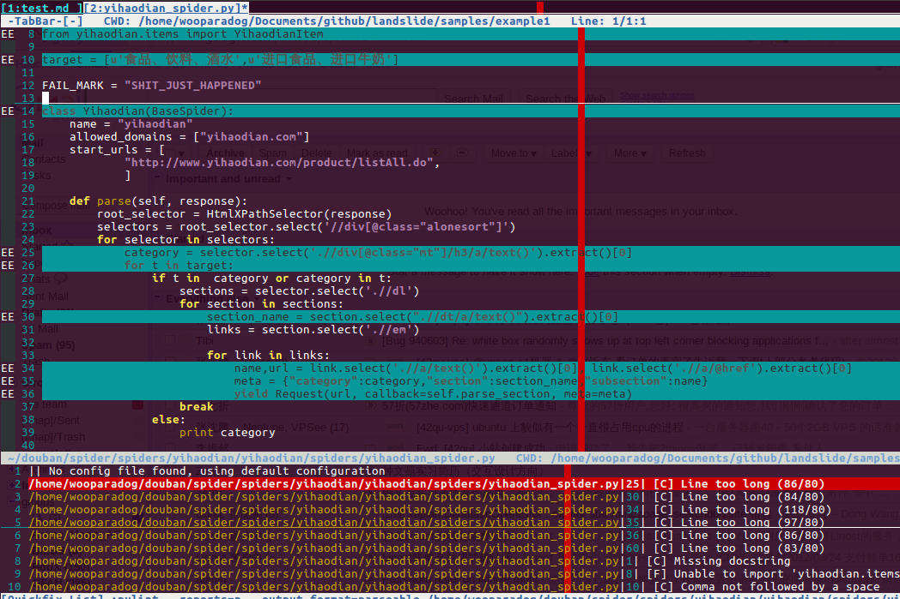

VIM For Python
=========

---
Basics
------

Mode:
-------
Normal/Insert/Visual

Motion:
-------
 - h j k l w b
 - until(t)
 - mark(m,`,')
 - ...

Command:
--------
verb + noun

 - c r i o a

---
Cheetsheet
----

Here is a 

[Cheetsheet](vi-vim-cheat-sheet.gif)

---

Auto complete
-------------

 - c-x c-o
 - c-x c-n
 - c-x c-p
 - c-x c-l
 - c-p
 - c-n

---
For Python
==========

---
Settings
========

---
Basic Settings:
---------------

    !vim
    set nocp
    filetype plugin on
    filetype indent on
    set hls number
    set backspace=eol,start,indent
    set fileformats=unix,dos
    set scrolloff=3
    set incsearch
    colorscheme blackbeauty
    syntax on
    set mouse =n

---

Indent:
-------

    !vim
    set smartindent
    set autoindent
    set tabstop=4 expandtab shiftwidth=4 softtabstop=4 
    set colorcolumn=79

---
Useful mapping:
---------------

    !vim
    map <C-J> <C-W>j
    map <C-K> <C-W>k
    map <C-l> <C-W>l
    map <C-h> <C-W>h
    nmap <leader>z :%s#\<<c-r>=expand("<cword>")<cr>\>#
    vnoremap <C-r> "hy:%s/<C-r>h//gc<left><left><left>

Useful command:
---------------

    !vim
    autocmd FileType python set makeprg=
        pylint\ --reports=n\ --output-format=parseable\ 
        --disable=E1101,W0611,W0614,R0401,C0103,C0322,C0111,
        C0324,C0301,W0142,R0913,W0622,C0323\ %:p

    autocmd FileType python set errorformat=%f:%l:\ %m

Now copen
---------

---
Define Function
---------------
[`!`] Quietly replace existing function .

    !vim

    function! CmdLine(str)
        exe "menu Foo.Bar :" . a:str
        emenu Foo.Bar
        unmenu Foo
    endfunction

    " From an idea by Michael Naumann
    function! VisualSearch(direction) range
        let l:saved_reg = @"
        execute "normal! vgvy"

        let l:pattern = escape(@", '\\/.*$^~[]')
        let l:pattern = substitute(l:pattern, "\n$", "", "")

        if a:direction == 'b'
            execute "normal ?" . l:pattern . "^M"
        elseif a:direction == 'gv'
            call CmdLine("vimgrep " . '/'. l:pattern . '/' . ' **/*.')
        elseif a:direction == 'f'
            execute "normal /" . l:pattern . "^M"
        endif

        let @/ = l:pattern
        let @" = l:saved_reg
    endfunction

---
Call Function
-------------
    !vim
    "  In visual mode when you press * or # to search for the current selection
    vnoremap <silent> * :call VisualSearch('f')<CR>
    vnoremap <silent> # :call VisualSearch('b')<CR>

    " When you press gv you vimgrep after the selected text
    vnoremap <silent> gv :call VisualSearch('gv')<CR>
    map <leader>g :vimgrep // **/*.<left><left><left><left><left><left><left>

---
Or run like this
----------------

    !vim
    map <F11> :call RunSrc()<CR>
    func RunSrc()
    exec "w"
    if &filetype == 'c'
    exec "!astyle --style=ansi --one-line=keep-statements -a --suffix=none %"
    elseif &filetype == 'perl'
    exec "!astyle --style=gnu --suffix=none %"
    elseif &filetype == 'py'||&filetype == 'python'
    exec "!python %"
    elseif &filetype == 'java'
    exec "!astyle --style=java --suffix=none %"
    elseif &filetype == 'go'
    exec "!go run %"
    elseif &filetype == 'modula2'
    exec "!landslide %;xdg-open presentation.html"
    endif
    exec "e! %"
    endfunc

---
Or even Python within Vim
-------------------------
    !python
    "python block
    python << EOF
    import vim
    def SetBreakpoint():
        import re

        nLine = int( vim.eval( 'line(".")'))

        strLine = vim.current.line
        strWhite = re.search( '^(\s*)', strLine).group(1)

        vim.current.buffer.append(
           "%(space)sipdb.set_trace() %(mark)s Breakpoint %(mark)s" %
             {'space':strWhite, 'mark': '#' * 30}, nLine - 1)

        for strLine in vim.current.buffer:
            if strLine == "import ipdb":
                break
        else:
            vim.current.buffer.append( 'import ipdb', 0)
            vim.command( 'normal j1')

next page...

---

    !python
    def RemoveBreakpoints():
        import re
        nCurrentLine = int( vim.eval( 'line(".")'))
        nLines = []
        nLine = 1
        for strLine in vim.current.buffer:
            if strLine == 'import ipdb' or strLine.lstrip()[:15] == 'ipdb.set_trace()':
                nLines.append( nLine)
            nLine += 1
        nLines.reverse()
        for nLine in nLines:
            vim.command( 'normal %dG' % nLine)
            vim.command( 'normal dd')
            if nLine < nCurrentLine:
                nCurrentLine -= 1
        vim.command( 'normal %dG' % nCurrentLine)
    EOF
    map <F2> :py RemoveBreakpoints()<cr>
    map <F3> :py SetBreakpoint()<cr>

---

Now Plugins
===========

---

Managing plugins:
-----------------

    !bash
    ├── after
    │   ├── ftplugin
    │   ├── plugin
    │   └── syntax
    ├── autoload
    │   ├── omni
    │   └── xml
    ├── bundle
    │   ├── go -> /home/wooparadog/Documents/googlecode/go_hg/misc/vim/
    │   ├── gocode -> /home/wooparadog/Documents/github/gocode/vim/
    │   ├── gundo
    │   └── nerdree
    ├── colors
    ├── doc
    ├── ftplugin
    │   └── python
    ├── indent
    ├── plugin
    ├── snippets
    ├── spell
    ├── syntax
    │   └── html
    ├── tags
    └── templates
---

Better with Pathogen
--------------------

[pathogen https://github.com/tpope/vim-pathogen](https://github.com/tpope/vim-pathogen)

    !bash
    bundle/
    ├── go -> /home/wooparadog/Documents/googlecode/go_hg/misc/vim/
    ├── gocode -> /home/wooparadog/Documents/github/gocode/vim/
    ├── gundo
    │   ├── autoload
    │   ├── doc
    │   ├── plugin
    │   ├── site
    │   └── tests
    └── nerdree
        ├── doc
        ├── nerdtree_plugin
        ├── plugin
        └── syntax
---

For Python
=========

---
Ropevim
-------
*A vim plugin for using rope python refactoring plugin in vim.*

---

Refactorings:
------------

 - Rename everything!
 - Extract method/local variable
 - Move class/function/module/package/method
 - Inline method/local variable/parameter
 - Restructuring 
 - Introduce factory
 - Change method signature
 - Transform module to package
 - Encapsulate field
 - Replace method with method object
 - And a few others

---

Refactoring Features:
----------------------
     
 - Extracting similar statements in extract refactorings
 - Fixing imports when needed
 - Previewing refactorings
 - Undo/redo refactorings
 - Stopping refactorings
 - Cross-project refactorings
 - Basic implicit interfaces handling in rename and change signature
 - Mercurial, GIT, Darcs and SVN support in refactorings

---

IDE helpers:
----------------------

 - Auto-completion
 - Definition location
 - Get pydoc
 - Find occurrences
 - Organize imports (remove unused and duplicate imports and sort them)
 - Generating python elements

---

Object Inference:
----------------------

 - Static and dynamic object analysis
 - Handling built-in container types
 - Saving object information on disk and validating them

---

Gundo
-----

Remember revision history

---
TabBar
-----

---
TagBar
--------

---
MR
--------

---
Pylint
------

